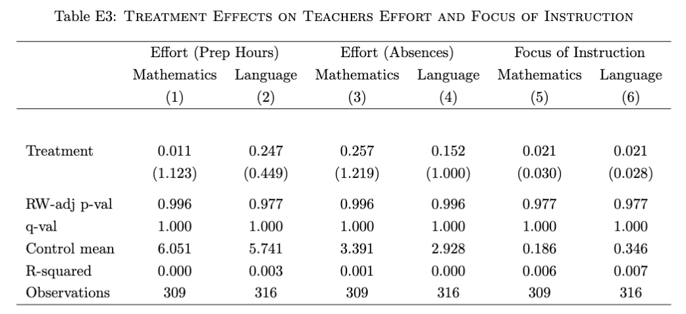
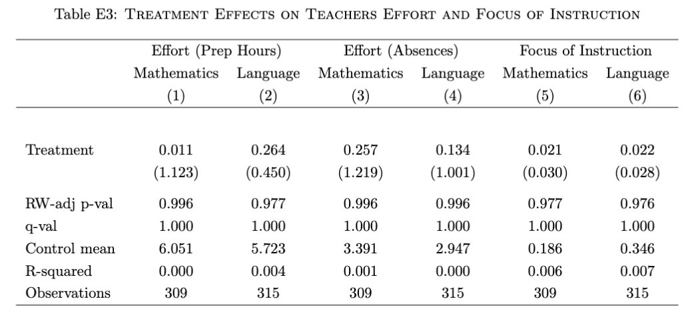

# Paper Identification

|  |   |
| ---  |  -------|
| ID  |   |
| Author  |   |
| Title  |   |
| Iteration |   |


Some useful information up front:

- [JPE Data and Code Availability Policy](https://www.journals.uchicago.edu/journals/jpe/datapolicy)
- [Step by step guidance from Data Editor for Authors](https://jpedataeditor.github.io/) 
- [Template README](https://social-science-data-editors.github.io/template_README/)


# Summary

In assessing compliance with our [Data and Code Availability Policy](https://www.journals.uchicago.edu/journals/jpe/datapolicy), our reproducibility team has identified the following issues, which we ask you to address:

1. Data Editor's first point.
2. Data Editor's second point.

# General

- [X] Data Availability and Provenance Statements
  - [X] Statement about Rights - Part 1: Right to use the data (e.g. *did the authors lawfully obtain the data*)
  - [X] Statement about Rights - Part 2: Right to publish the data (e.g. *are human subjects involved and did permission been granted to publish their data?*)
  - [ ] License for Data (optional, but recommended)
  - [X] Details on each Data Source
- [X] Dataset list
- [X] Computational requirements
  - [X] Software Requirements
  - [X] Controlled Randomness (as necessary)
  - [X] Memory, Runtime, and Storage Requirements
- [X] Description of programs/code
  - [X] License for Code (Optional, but recommended) 
  - [X] Details (as necessary)
- [ ] List of tables and programs
- [X] References (Optional, but recommended) 

# High-level Description of Research Project

*This research project...*

- [X] uses observational data.
- [X] uses *confidential* observational data.
- [ ] uses data generated via experiment or trial by the authors (in field or lab).
  - [ ] For lab experiments: The code to implement the experimental protocol (z-Tree, o-Tree etc) is included in the package.
  - [ ] A PDF copy of IRB approval is contained in the package.
  - [ ] A PDF document outlining the design of the experiment, including information on the selection and eligibility of participants is included.
  - [ ] A PDF copy of the instructions given to participants in both original language and an English translation is included.
- [X] uses data generated via survey by the authors (in field or online)
  - [ ] The programs used to administer the survey (e.g. qualtrics survey file) are included.
  - [ ] A PDF copy of IRB approval is contained in the package.
  - [ ] A PDF of the original questionaire(s) and information on the selection and eligibility of participants is included.
- [ ] is a simulation study: the data are generated by an algorithm.
- [ ] is a numerical illustration: no data are used but code is used to produce illustrative output (tables, figures)

Original surveys are included, but replication found no information on the selection and eligibility of participants no copy of IRB approval. Survey was administered on paper, no program files expected.

# Data description

For any data that cannot be provided as part of the replication package, please provide the following information as part of the README.

> {REQUIRED}  Please specify how long the data will be preserved in the restricted-access location.

> {REQUIRED} Please provide affirmation of support for replication checks.
  - As per the [JPE policy](https://jpedataeditor.github.io/policy.html), "In cases where data cannot be published in an openly accessible trusted data repository like the JPE dataverse, authors who have requested an exemption to publish them at the time of first submission must commit to preserving the data and code for a period of no less than five years following the publication of the paper. They should also provide reasonable assistance to requests for clarification and replication."


> {REQUIRED} Please provide a codebook for the data.
  - The codebook should at a minimum describe the variables obtained from the data source, in a manner that will let others verify that they have obtained a substantially similar dataset if successfully obtaining access to the data.


## Data Sources

| file/name | public | private | DOI/URL | Access described | cited readme | cited paper |
| ---- | --- | --- | --- | --- | ---- | ---- |
| `data/raw/August_survey/*` | yes | no | no | yes | yes | yes |
| `data/raw/Teachers_and_principals/*` | yes | no | no | yes | yes | yes |
| `data/raw/Enrollment/*` | yes | no | [yes](https://datosabiertos.mineduc.cl/matricula-en-educacion-superior/) | yes | yes | yes |
| `data/raw/Graduation/*` | yes | no | [yes](https://datosabiertos.mineduc.cl/titulados-en-educacion-superior/) | yes | yes | yes |
| `data/raw/High_school_registration/*` | yes | no | [yes](https://datosabiertos.mineduc.cl/matricula-por-estudiante-2/) | yes | yes | yes |
| `data/raw/Low_SES/*` | yes | no | [yes](https://datosabiertos.mineduc.cl/alumnos-preferentes-prioritarios-y-beneficiarios-sep/) | yes | yes | yes |
| `confidential-data-not-for-publication/raw/Admission/*` | no | yes | no | yes | yes | yes |
| `confidential-data-not-for-publication/raw/Postulantes Cupos Regulares/*` | no | yes | no | yes | yes | yes |
| `confidential-data-not-for-publication/raw/April_survey/Estudio_PACE_Estudiantes_MRUN.*` | no | yes | no | yes | yes | yes |
| `confidential-data-not-for-publication/raw/April_survey/data_expvar_*` | no | yes | no | yes | yes | yes |
| `confidential-data-not-for-publication/raw/Distance_and_transfers_to_universities/*` | no | yes | no | yes | yes | yes |
| `confidential-data-not-for-publication/raw/GPA/Notas_por_estudiante_y_subsector_*` | no | yes | no | yes | yes | yes |
| `confidential-data-not-for-publication/raw/GPA/Rendimiento*` | no | yes | no | yes | yes | yes |
| `confidential-data-not-for-publication/raw/GPA/*NEM_PERCENTILES*` | no | yes | no | yes | yes | yes |
| `confidential-data-not-for-publication/raw/High_school_registration/*PACE*`, `*missing*` | no | yes | no | yes | yes | yes |
| `confidential-data-not-for-publication/raw/List_experimental_high_schools/*` | no | yes | no | yes | yes | yes |
| `confidential-data-not-for-publication/raw/List_selective_colleges/*` | no | yes | no | yes | yes | yes |
| `confidential-data-not-for-publication/raw/major_class/*` | no | yes | no | yes | yes | yes |
| `confidential-data-not-for-publication/raw/PSU/*` | no | yes | [yes](https://www.psu.demre.cl/portales/condiciones-uso-informacion-datos-abiertos) | yes | yes | yes |
| `confidential-data-not-for-publication/raw/Simce/*` | no | yes | [yes](https://www.agenciaeducacion.cl/simce/) | yes | yes | yes |
| `confidential-data-not-for-publication/raw/Teachers_and_principals/*` | no | yes | no | yes | yes | yes |

# Requirements 

- [X] README is in TXT, MD, or PDF format
- [X] README is accessible at the root of the package (not inside a folder)
- [X] Title conforms to guidance (starts with "Data and Code for: Title of Paper" or "Code for: Title of Paper", is properly capitalized)
- [X] Authors (with affiliations) are listed in the same order as on the paper

## Stated Requirements

- [ ] No requirements specified
- [X] Software Requirements specified as follows:
  - Local steps
    - Windows 10
    - Julia v1.10.5
    - Stata/MP v18.0
    - Python v3.7+
  - Cluster Steps
    - Linux-based system (HPC Cluster)
    - Julia v1.11.1
- [X] Computational Requirements specified as follows:
  - Local steps
    - RAM: 32 GB – 64 GB
  - Cluster Steps
    - Storage: 15 GB (temporary filesystem per job)
    - RAM: 64 GB per job
- [X] Time Requirements specified as follows:
  - Local steps, total runtime: ~9 days 8 hours
  - Cluster Steps, total runtime: ~1 day per sample

- [x] Requirements are complete.


# Analyzing Data and Code Files











## Code description

The replication package contains a multi-step Stata/Julia/Python pipeline in 27 steps, arranged in 7 main blocks, plus a final step to compile the paper in LaTeX. The pipeline is divided into local machine and cluster work (3rd main block).




- [ ] The replication package contains a "main" or "master" file(s) which calls all other auxiliary programs.

> {SUGGESTED} We strongly advise the use of a single (or a small number of) main control file(s) to automatically reproduce all figures and tables in the paper, without manual interaction.

> NOTE: In-text numbers that reference numbers in tables do not need to be listed. Only in-text numbers that correspond to no table or figure need to be listed.

## Computing Environment of the Replicator

- Nuvolos Cloud, Ubuntu 22.04.2 LTS, 16-core CPU, 64 GB RAM, 100 GB storage
- Stata/MP 18.0
- Python 3.10
- Julia 1.10.4

# Replication {#sec-findings}

- Downloaded code and data from dropbox.
- Ran Replication Steps 1-13 (Stata).
- On our Linux-based system, extensions are case-sensitive, so we encountered the following type of errors

```stata
. import delimited "$dataRawPublic/High_school_registration/20140924_Matricula_u
> nica_2014_20140430_PUBL.CSV", clear 
file
/files/Replication_Tincani_Kosse_Miglino/data/raw/High_school_registration/20140
> 924_Matricula_unica_2014_20140430_PUBL.CSV not found
r(601);
```

```stata
. import delimited "$dataRawPublic/High_school_registration/20160926_Matricula_ 
> Unica_2016_20160430_PUBL.csv", delimiter(";") clear 
file /files/Replication_Tincani_Kosse_Miglino/data/raw/High_school_registration/20160 
> 926_Matricula_Unica_2016_20160430_PUBL.csv not found 
r(601);
```

```stata
. use "$dataTemp/ranking_selected_applications_pace.dta", clear
file
    /files/Replication_Tincani_Kosse_Miglino/confidential-data-not-for-publication/
    > processed/ranking_selected_applications_pace.dta not found
r(601);

```

- To solve this, replicator ran a script fixing all package .csv files to have lower case extension and scripts to call them with lower case extension. Similarly, all "_Unica" were replaced with "_unica" and "_PACE" with "_pace".

- Loaded solutions uploaded by the authors for step 14. Proceeded to run steps 15-18 (Julia).

```bash
(base) 10:25:47 - nuvolos:/files/Replication_Tincani_Kosse_Miglino$ julia code/julia/
> 15.Simulations_rescale.jl 
  Activating project at `/files/Replication_Tincani_Kosse_Miglino/code/julia`
ERROR: LoadError: ArgumentError: Package Juniper [2ddba703-00a4-53a7-87a5-e8b9971dde84] 
> is required but does not seem to be installed:
 - Run `Pkg.instantiate()` to install all recorded dependencies.
```

- Had to install  julia libraries before running (Pkg.instantiate). Just using Pkg.activate() was not enough to actually retrieve the libraries.

- Loaded solutions provided by authors for major step 3 (Julia cluster bootstrapping). Ran Python script.

- Ran steps 19-24. Loaded included solutions for step 25. Finally ran steps 26-27.

- Substituted .tex files' paths. All paths in the included code/tex/ were pointing at non-existing directories in the package, such as `Revision/abstract.tex` or `Revision/Figures R/TE_effort_byrank_fe_model1.png`. With the use of AI, replicator mapped and replaced 137 paths to the correct location in the package-generated output.

- Code ran to completion.

# Findings {#sec-findings}

## Data Preparation Code

All data preparation code ran without issues after case-sensitivity fixes described in @sec-findings. 

Authors are invited to fix these issues in their package.

## Tables and Figures

All replicated figures and tables match the ones in the accepted version of the paper except for **Table E3**, for which the number of observations is different for columns (2), (4) and (6) and consequently results differ. Below, we report a comparison of the two tables and the full replication table for figures and tables.

::: {#fig-three layout-ncol=2}




:::

| Figure/Table #                                                                    | Program                                              | Line Number | Reproduced? |
|-----------------------------------------------------------------------------------|------------------------------------------------------|-------------|-------------|
| Table 1 - sample_balance.tex                                                      | code/stata/9.Tables.do                               | 58          | yes         |
| Table 2 - Overview of Data                                                        | code/tex/data.tex                                    | 7           | yes         |
| Figure 1 - histogram_simce_control_all.png; histogram_simce_controltop15_all.png  | code/stata/10.Figures.do                             | 24; 34      | yes         |
| Table 3 - summary_stats_outcomes.tex                                              | code/stata/9.Tables.do                               | 191         | yes         |
| Figure 2 - TE_over_time_enrolled_SUA_in_experimental_schools.png                  | code/stata/10.Figures.do                             | 130         | yes         |
| Table 4 - TE_pre_college_outcomes.tex                                             | code/stata/9.Tables.do                               | 262         | yes         |
| Figure 3 - heterog_effects_effort_score.png                                       | code/stata/10.Figures.do                             | 210         | yes         |
| Table 5 - summary_beliefs.tex                                                     | code/stata/9.Tables.do                               | 316         | yes         |
| Table 6 - TE_pre_college_outcomes_perceived_dist_cutoff_f.tex                     | code/stata/9.Tables.do                               | 378         | yes         |
| Figure 4 - histogram_p_graduate_T_C.png                                           | code/stata/10.Figures.do                             | 289         | yes         |
| Figure 5 - returns_effort_PSUGPA_raw_answers_comb.png                             | code/stata/10.Figures.do                             | 304         | yes         |
| Table 7 - causal_correlational_returns_eff_pers.tex                               | code/stata/27.Tables_Figures_model_numbers.do        | 257         | yes         |
| Figure 6 - TE_over_time_enrolled_SUA.png                                          | code/stata/27.Tables_Figures_model_numbers.do        | 2823        | yes         |
| Figure 7 - TE_effort_byrank_fe_model1.png                                         | code/stata/27.Tables_Figures_model_numbers.do        | 2872        | yes         |
| Table 8 - TE_pre_college_outcomes_model_fit.tex                                   | code/stata/27.Tables_Figures_model_numbers.do        | 476         | yes         |
| Table 9 - simulated_ATEs_RE.tex                                                   | code/stata/27.Tables_Figures_model_numbers.do        | 2700        | yes         |
| Figure 8 - TE_over_time_enrolled_SUA_count.png                                    | code/stata/27.Tables_Figures_model_numbers.do        | 3207        | yes         |
| Table 10 - simulated_ATEs.tex                                                     | code/stata/27.Tables_Figures_model_numbers.do        | 1176        | yes         |
| Figure 9 - Counterfactual_multiple_cutoffs_avg_individual_TE.png                  | code/stata/27.Tables_Figures_model_numbers.do        | 3622        | yes         |
| Figure B1 - enrollment_SUA_gradient.png                                           | code/stata/10.Figures.do                             | 329         | yes         |
| Figure B2 - hist_majors_pace_regular_slots.png                                    | code/stata/10.Figures.do                             | 352         | yes         |
| Figure B3 - hist_quality_pace_regular_slots.png                                   | code/stata/10.Figures.do                             | 377         | yes         |
| Figure B4 - timeline.png                                                          | code/tex/timeline.png                                | -           | yes         |
| Figure B5 - sit_PSU_prepared_admitted_lpoly_inpaper.png                           | code/stata/10.Figures.do                             | 395         | yes         |
| Figure B6 - PSU_belief_actual_distribution.png                                    | code/stata/10.Figures.do                             | 417         | yes         |
| Figure B7 - GPA_hist.png                                                          | code/stata/10.Figures.do                             | 425         | yes         |
| Figure B8 - discrimination.png                                                    | code/stata/10.Figures.do                             | 438         | yes         |
| Figure B9 - beliefs_hetero_byranksimce_inpaper.png                                | code/stata/10.Figures.do                             | 470         | yes         |
| Figure B10 - heterog_effects_p_grad.png                                           | code/stata/10.Figures.do                             | 555         | yes         |
| Figure B11 - admission_regular_PSU_fit.png                                        | code/stata/10.Figures.do                             | 593         | yes         |
| Figure B12 - admission_quality_fit_rescale.png                                    | code/stata/10.Figures.do                             | 693         | yes         |
| Figure B13 - TE_perceived_returns_effort_REC_REPT.png                             | code/stata/27.Tables_Figures_model_numbers.do        | 3677        | yes         |
| Figure B14 - effects_info_CC_bysimce.png                                          | code/stata/27.Tables_Figures_model_numbers.do        | 4030        | yes         |
| Figure B15 - college_entrants_multiple_cutoffs_count.png                          | code/stata/27.Tables_Figures_model_numbers.do        | 4241        | yes         |
| Table C1 - summary_stats_geog_regular_PACE.tex                                    | code/stata/9.Tables.do                               | 554         | yes         |
| Table C2 - List_Majors.tex                                                        | code/tex/List_Majors.tex                             | 4           | yes         |
| Table C3 - summary_statistics_target_population.tex                               | code/stata/9.Tables.do                               | 593         | yes         |
| Table C4 - TE_applications_admissions.tex                                         | code/stata/9.Tables.do                               | 687         | yes         |
| Table C5 - TE_enrolled_over_time.tex                                              | code/stata/9.Tables.do                               | 788         | yes         |
| Table C6 - TE_enrolled_over_time_top15.tex                                        | code/stata/9.Tables.do                               | 864         | yes         |
| Table C7 - summary_stats_outcomes_TC.tex                                          | code/stata/9.Tables.do                               | 956         | yes         |
| Table C8 - TE_effort_items.tex                                                    | code/stata/9.Tables.do                               | 1026        | yes         |
| Table C9 - TE_psu.tex                                                             | code/stata/9.Tables.do                               | 1122        | yes         |
| Table C10 - TE_enrolled_over_time_STEM.tex                                        | code/stata/9.Tables.do                               | 1189        | yes         |
| Table C11 - TE_enrolled_over_time_top15_STEM.tex                                  | code/stata/9.Tables.do                               | 1271        | yes         |
| Table C12 - RCT_selectivity_distance_only_selective.tex                           | code/stata/9.Tables.do                               | 1350        | yes         |
| Table C13 - leebounds_selectivity_distance_only_selective.tex                     | code/stata/9.Tables.do                               | 1423        | yes         |
| Table C14 - TE_college_entrants.tex                                               | code/stata/9.Tables.do                               | 1466        | yes         |
| Table C15 - persistence_SUA.tex                                                   | code/stata/9.Tables.do                               | 1532        | yes         |
| Table C16 - belief_elicitation.tex                                                | code/tex/belief_elicitation.tex                      | 3           | yes         |
| Table C17 - correlates_belief_biases.tex                                          | code/stata/9.Tables.do                               | 1573        | yes         |
| Table C18 - p_graduate_reg_whole_sample.tex                                       | code/stata/9.Tables.do                               | 1621        | yes         |
| Table C19 - summary_perceived_returns_construction.tex                            | code/stata/9.Tables.do                               | 1675        | yes         |
| Table C20 - params_outside_model_regularadm.tex                                   | code/stata/11.Data_for_model_estimation_rescale.do   | 279         | yes         |
| Table C21 - params_outside_model_rescale.tex                                      | code/stata/11.Data_for_model_estimation_rescale.do   | 368         | yes         |
| Table C22 - structural_model_estimates_edited.tex                                 | code/python/add_params_ses_to_table_csv_estimates.py | 51          | yes         |
| Table C23 - summary_stats_outcomes_model_fit.tex                                  | code/stata/27.Tables_Figures_model_numbers.do        | 1665        | yes         |
| Table C24 - fit_TE_moments_adm_enr_per.tex                                        | code/stata/27.Tables_Figures_model_numbers.do        | 1879        | yes         |
| Table D1 - in_out_flow.tex                                                        | code/stata/9.Tables.do                               | 1835        | yes         |
| Table D2 - attrition_both.tex                                                     | code/stata/9.Tables.do                               | 1866        | yes         |
| Table D3 - leebounds_effort_achievement.tex                                       | code/stata/9.Tables.do                               | 1923        | yes         |
| Table D4 - validate_achievement_effort.tex                                        | code/stata/9.Tables.do                               | 1956        | yes         |
| Table D5 - tab_reduced_form_irt.tex                                               | code/stata/9.Tables.do                               | 2049        | yes         |
| Table D6 - TE_subjective_expectations_michela.tex                                 | code/stata/9.Tables.do                               | 2102        | yes         |
| Table D7 - sample_balance_within_med_exp_PSU.tex                                  | code/stata/9.Tables.do                               | 2176        | yes         |
| Table D8 - validate_beliefs.tex                                                   | code/stata/9.Tables.do                               | 2223        | yes         |
| Figure D1 - type_histogram_2types.png; type_histogram_3types.png                  | code/stata/27.Tables_Figures_model_numbers.do        | 5130; 5139  | yes         |
| Table D9 - summary_stats_outcomes_3types.tex                                      | code/stata/27.Tables_Figures_model_numbers.do        | 4526        | yes         |
| Table D10 - TE_pre_college_outcomes_3types.tex                                    | code/stata/27.Tables_Figures_model_numbers.do        | 4872        | yes         |
| Table D11 - fit_TE_moments_adm_enr_per_3types.tex                                 | code/stata/27.Tables_Figures_model_numbers.do        | 5063        | yes         |
| Table E1 - tab_grading.tex                                                        | code/stata/9.Tables.do                               | 2331        | yes         |
| Table E2 - tab_principal.tex                                                      | code/stata/9.Tables.do                               | 2357        | yes         |
| Table E3 - teachers_effort.tex                                                    | code/stata/9.Tables.do                               | 2405        | **no**          |
| Table E4 - tab_principal2.tex                                                     | code/stata/9.Tables.do                               | 2433        | yes         |
| Table E5 - exp_earnings.tex                                                       | code/stata/9.Tables.do                               | 2483        | yes         |
| Figure F1 - histogram_quality_regular_T_C_comb.png                                | code/stata/10.Figures.do                             | 948         | yes         |
| Figure F2 - histogram_quality_T_PACE_regular_top15_comb.png                       | code/stata/10.Figures.do                             | 960         | yes         |
| Figure F3 - histogram_distance_regular_T_C_comb.png                               | code/stata/10.Figures.do                             | 972         | yes         |
| Figure F4 - histogram_distance_top15_comb.png                                     | code/stata/10.Figures.do                             | 983         | yes         |
| Figure F5 - histogram_field_regular_T_C_comb.png                                  | code/stata/10.Figures.do                             | 994         | yes         |
| Figure F6 - histogram_field_T_PACE_regular_top15_comb.png                         | code/stata/10.Figures.do                             | 1005        | yes         |
| Table F1 - TE_regular_admissions_enrollments_f.tex                                | code/stata/9.Tables.do                               | 2598        | yes         |
| Table F2 - summary_stats_applications_assignments_top15_all.tex                   | code/stata/9.Tables.do                               | 2664        | yes         |
| Table F3 - TE_applications_assignments_top15.tex                                  | code/stata/9.Tables.do                               | 2800        | yes         |
| Table F4 - differences_pace_regular_for_treated_top15.tex                         | code/stata/9.Tables.do                               | 2921        | yes         |
| Figure G1 - PSU_GPA_ppersist_belief_GoF.png                                       | code/stata/10.Figures.do                             | 1417        | yes         |
| Table G1 - params_outside_model_PSUbGPAb.tex                                      | code/stata/11.Data_for_model_estimation_rescale.do   | 591         | yes         |
| Figure G2 - PSUbGPAb_belief_GoF_nolasso.png                                       | code/stata/11.Data_for_model_estimation_rescale.do   | 635         | yes         |
| Table G2 - Targeted parameters from descriptive regressions                       | code/tex/auxiliary_parameters.tex                    | 31          | yes         |
| Table G3 - Targeted parameters from regressions linking endogenous model outcomes | code/tex/auxiliary_parameters.tex                    | 84          | yes         |
| Figure H1 - college_entrants_info_count.png                                       | code/stata/27.Tables_Figures_model_numbers.do        | 3443        | yes         |

## In-Text Numbers

- [x] In-text numbers verified.

- [ ] There are no in-text numbers, or all in-text numbers stem from tables and figures.

- [ ] There are in-text numbers, but they are not identified in the code

| In-text numbers                                                           | Program                           | Line Number   | Reproduced? |
|---------------------------------------------------------------------------|-----------------------------------|---------------|-------------|
| SIMCE gap: targeted schools vs regular entrants                           | code/stata/27b.In_text_numbers.do | 15            | yes         |
| Year-5 continuous enrollment effect                                       | code/stata/27b.In_text_numbers.do | 20            | yes         |
| Year-5 effect as percent of control mean                                  | code/stata/27b.In_text_numbers.do | 24            | yes         |
| p-value for difference between year-5 and year-1 effects                  | code/stata/27b.In_text_numbers.do | 32            | yes         |
| Top-15 sample year-1 enrollment effect                                    | code/stata/27b.In_text_numbers.do | 39            | yes         |
| Top-15 sample year-5 enrollment effect                                    | code/stata/27b.In_text_numbers.do | 43            | yes         |
| Top-15 p-value: year-5 vs year-1 effects                                  | code/stata/27b.In_text_numbers.do | 47            | yes         |
| Top-15 sample year-1 percent change                                       | code/stata/27b.In_text_numbers.do | 51            | yes         |
| Top-15 sample year-5 percent change                                       | code/stata/27b.In_text_numbers.do | 55            | yes         |
| Estimated shares of model types 1 and 2                                   | code/stata/27b.In_text_numbers.do | 68            | yes         |
| Three-type model share assigned to type 3                                 | code/stata/27b.In_text_numbers.do | 77            | yes         |
| Believed persistence probability                                          | code/stata/27b.In_text_numbers.do | 82            | yes         |
| Actual persistence probability                                            | code/stata/27b.In_text_numbers.do | 98            | yes         |
| College-degree earnings premium belief                                    | code/stata/27b.In_text_numbers.do | 107           | yes         |
| Financial-aid awareness share and p-value                                 | code/stata/27b.In_text_numbers.do | 116           | yes         |
| Correlation between raw GPA and PRN                                       | code/stata/27b.In_text_numbers.do | 121           | yes         |
| Surveyed students: N and percent of enrolled students                     | code/stata/27b.In_text_numbers.do | 128           | yes         |
| Shares of tertiary enrollments by institution type                        | code/stata/27b.In_text_numbers.do | 158           | yes         |
| Family income of targeted students relative to Chile and regular entrants | code/stata/27b.In_text_numbers.do | 172           | yes         |
| Top-15 targeted-student achievement vs regular entrants                   | code/stata/27b.In_text_numbers.do | 190           | yes         |
| Share reporting preparation for PSU                                       | code/stata/27b.In_text_numbers.do | 195           | yes         |
| Parents not studying beyond secondary education                           | code/stata/27b.In_text_numbers.do | 202; 207; 209 | yes         |
| Average minimum PSU required for regular admission                        | code/stata/27b.In_text_numbers.do | 214           | yes         |
| Median subjective expectation for PSU score                               | code/stata/27b.In_text_numbers.do | 217           | yes         |
| Type-2 share difference among treated college entrants                    | code/stata/27b.In_text_numbers.do | 233           | yes         |

## Other issues

As described in @sec-findings, Julia packages were not correctly instantiated and tex paths were not correctly specified. Authors are invited to fix these issues. For simplicity, replicator included a .csv file with all replacements in the repository linked to this report.

# Classification

- [ ] full reproduction
- [x] full reproduction with minor issues
- [ ] partial reproduction (see above)
- [ ] not able to reproduce most or all of the results (reasons see above)

## Reason for incomplete reproducibility

- [ ] None.
- [x] `Discrepancy in output` (either figures or numbers in tables or text differ)
- [x] `Bugs in code` that were fixable by the replicator (but should be fixed in the final deposit)
- [ ] `Code missing`, in particular if it prevented the replicator from completing the reproducibility check
  - [ ] `Data preparation code missing` should be checked if the code missing seems to be data preparation code
- [ ] `Code not functional` is more severe than a simple bug: it prevented the replicator from completing the reproducibility check
- [ ] `Software not available to replicator` may happen for a variety of reasons, but in particular (a) when the software is commercial, and the replicator does not have access to a licensed copy, or (b) the software is open-source, but a specific version required to conduct the reproducibility check is not available.
- [ ] `Insufficient time available to replicator` is applicable when (a) running the code would take weeks or more (b) running the code might take less time if sufficient compute resources were to be brought to bear, but no such resources can be accessed in a timely fashion (c) the replication package is very complex, and following all (manual and scripted) steps would take too long.
- [ ] `Data missing` is marked when data *should* be available, but was erroneously not provided, or is not accessible via the procedures described in the replication package
- [ ] `Data not available` is marked when data requires additional access steps, for instance purchase or application procedure. 
- [ ] `Missing README` is marked if there is no README to guide the replicator, or the README is not in compliance with JPE requirements